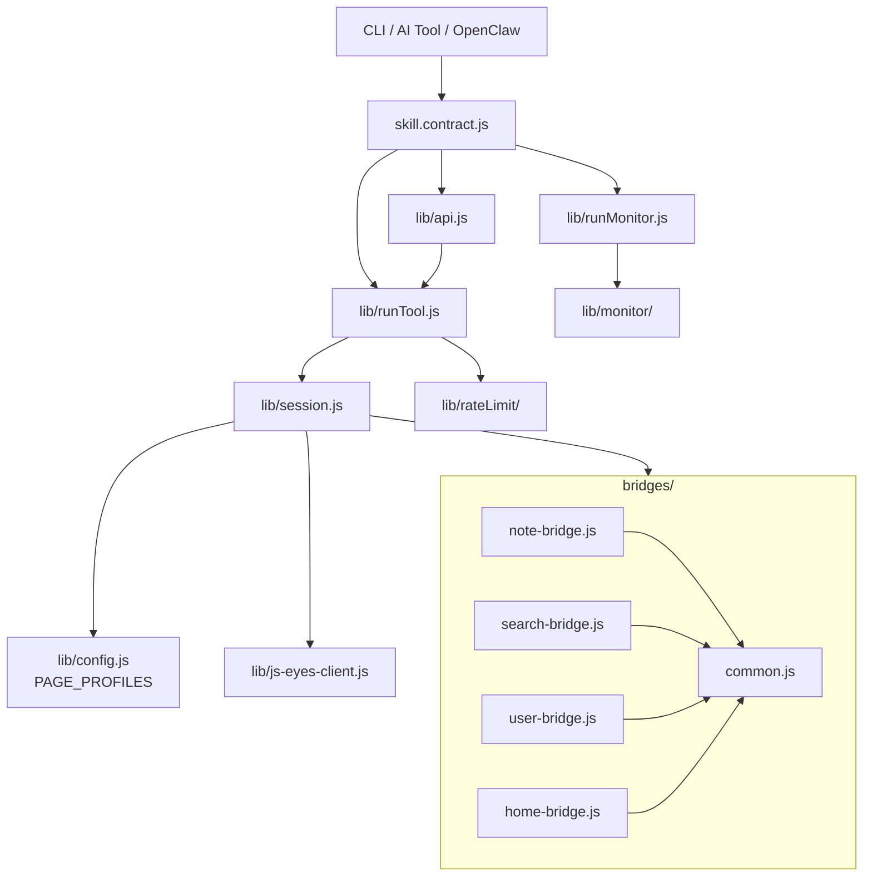

# 小红书 ops skill v2.0 → v3.0 架构升级

> 日期：2026-05-05
> 项目：js-eyes / skills/js-xiaohongshu-ops-skill
> 类型：升级迁移 / 架构设计 / 技能开发
> 来源：Cursor Agent 对话

---

## 目录

1. [背景与动机](#1-背景与动机)
2. [分析过程](#2-分析过程)
3. [方案设计](#3-方案设计)
4. [实现要点](#4-实现要点)
5. [验证与测试](#5-验证与测试)
6. [实战冒烟与补丁（P0 + P1）](#6-实战冒烟与补丁p0--p1)
7. [后续演化](#7-后续演化)

---

## 1. 背景与动机

`skills/js-xiaohongshu-ops-skill` v2.0.1 基线只有 1 个工具 `xhs_get_note`，由 `skill.contract.js` 直接调 `lib/api.js::getNote` → `lib/xiaohongshuUtils.js`。**没有** PAGE_PROFILES、Session、bridge 版本管控、INTERACTIVE 导航、监控子系统、反爬 audit。

而同仓的 `skills/js-x-ops-skill`（X.com）已经演进到一套成熟的 **PAGE_PROFILES + Bridges + Session + Monitor** 架构。同时 `agent-js` 项目里 `DeepSearchWorkflow/lib/xhsScraperService` 与 `xhsSearch.js` 沉淀了大量小红书专属的反爬 / 限流 / DOM 选择器经验。

目标：**以 X skill 架构为骨、以 agent-js 经验为肉**，把 xhs skill 升级到 v3.0，对齐主线能力（搜索、用户域、监控、限流、visual、recording sanitize），并按 9 个 PR 渐进交付。

## 2. 分析过程

### 2.1 三方架构对比

| 维度 | xhs v2.0.1（旧） | x-ops-skill | agent-js xhs 模块 |
| ---- | ---- | ---- | ---- |
| 调度 | 单文件直调 | PAGE_PROFILES + Session + runTool | 分层 service |
| Bridge | 无 | 五件套 + version + `// @@include` | 长 DOM 脚本，无版本 |
| 数据策略 | DOM only | GraphQL 优先，DOM 兜底 | DOM + 同源 API |
| 反爬 | 无 | 仅 429 暂停 | meta 完整性 + 连续 risk hit 暂停 5 分钟 |
| 监控 | 无 | accounts only | 无 |
| Recording | 接 `@js-eyes/skill-recording` | 同左 + audit 字段全 | 自管 |
| Visual | 无 | 接 `@js-eyes/visual-bridge-kit` | 无 |

### 2.2 关键约束发现

1. **小红书 DOM 比 GraphQL 稳**：与 X 取反——`auto = DOM 优先 + API 兜底`，仅评论分页走 API 主路径（edith `/api/sns/web/v2/comment/page`）。
2. **`a1` / `web_session` 是身份核心**：必须在 history / debug 落盘前强制 mask。
3. **小红书需要软限流**：连续 risk hit → 暂停 5 分钟（agent-js 验证过的策略），`detectAntiCrawl` 通过 `og:xhs:note_like/comment/collect` 三件 meta 完整性判定。
4. **监控对象不是单一类型**：用户主页 + 关键词搜索两类 target，需要在 X 的 schema 上扩展 `accounts[] + searches[]`。
5. **DESTRUCTIVE 永不引入**：xhs skill 不发笔记 / 不评论 / 不点赞 / 不收藏 / 不关注，是硬红线。

## 3. 方案设计

总体目标架构：



### 关键决策

| 决策 | 选择 | 理由 |
| ---- | ---- | ---- |
| `readMode=auto` 默认策略 | DOM 优先 + API 兜底 | xhs DOM 覆盖广、稳定；同源 feed JSON 受反爬影响大 |
| 评论提取 | API 主路径 | edith `/api/sns/web/v2/comment/page` 分页稳定 |
| 安全分级 | READ + INTERACTIVE，**永不 DESTRUCTIVE** | 与 X 取反；avoid 账号风险 |
| 监控 schema | `accounts[] + searches[]` 双类 target | 关键词监控是 xhs 高频需求 |
| 限流位置 | bridge 软限流 + Node 侧令牌桶 | 双层：浏览器内连续 risk hit 暂停 5 分钟；Node 侧可选包一层 limiter |
| visual 集成 | lazy require + try/catch 降级 | 缺包时静默 noop，不阻塞 READ 主管道 |
| `makeBridgeExpander` | 简化版，仅相对路径 `// @@include ./common.js` | 早期 PR 不引入 `visual-bridge-kit` 依赖；v3.x PR-9 再补 |
| 拆 PR 粒度 | 9 个 PR，跨 v2.1 / v2.2 / v2.3 / v3.0 / v3.x | 每个 PR 独立可验收，互不阻塞 |

### 阶段划分

| 阶段 | PR | 交付 |
| ---- | -- | ---- |
| v2.1 | PR-1 | 架构铺底（config / session / runTool / commands / xhsUtils / CLI dispatcher） |
| v2.1 | PR-2 | `bridges/common.js` + `bridges/note-bridge.js`（VERSION=0.1.0，五件套 + getNote/getComments） |
| v2.1 | PR-3 | 工厂化 `skill.contract.js`，`xhs_get_note` / `xhs_get_note_comments` / `xhs_session_state` |
| v2.2 | PR-4 | `search-bridge.js` + `xhs_search_notes` + 4 个 `xhs_navigate_*` |
| v2.3 | PR-5 | `user-bridge.js` + `home-bridge.js` 占位 + `xhs_get_user` / `xhs_get_user_notes` |
| v3.0 | PR-6 | `lib/monitor/` 内核（10 个文件，schema v1 同时支持 accounts + searches） |
| v3.0 | PR-7 | `lib/runMonitor.js` + 5 个受控 AI 监控工具（不触发 webhook） |
| v3.x | PR-8 | `lib/rateLimit/`（令牌桶 + antiCrawlingStats），audit 增 `antiCrawlState` |
| v3.x | PR-9 | visual-bridge-kit 接入（三档旋钮）+ cache key 维度 + sanitize 单测 |

## 4. 实现要点

### 项目结构（终态）

```
skills/js-xiaohongshu-ops-skill/
├── SKILL.md                     v3.0.0
├── package.json                 3.0.0，依赖 @js-eyes/{config,skill-recording,visual-bridge-kit}
├── index.js                     委托 cli/index.js
├── skill.contract.js            工厂化 + 15 个工具声明
├── cli/index.js                 dispatcher（读 lib/commands.js）
├── lib/
│   ├── api.js                   编程 API（useBridge → runTool）
│   ├── session.js               主调度器（含简化版 makeBridgeExpander）
│   ├── runTool.js               READ 主管道 + audit + 可选 visual + 可选 limiter
│   ├── runMonitor.js            5 个受控 AI 工具
│   ├── config.js                PAGE_PROFILES（note / search / user / home）
│   ├── commands.js              CLI 声明式命令表 + parseArgv
│   ├── toolTargets.js / runtimeConfig.js / js-eyes-client.js / bridgeAdapter.js
│   ├── xhsUtils.js              URL 规整 + sanitizeForRecording
│   ├── rateLimit/
│   │   ├── limiter.js           令牌桶（minInterval / maxRandomDelay / maxConcurrent）
│   │   └── antiCrawlingStats.js 反爬统计落盘
│   └── monitor/
│       ├── paths.js / config.js / state.js / dedup.js
│       ├── format.js / notify.js / logs.js
│       ├── fetchUserNotes.js / fetchSearch.js
│       ├── runCheck.js / daemon.js / dispatcher.js
├── bridges/
│   ├── common.js                fetchXhsApi + parseNoteMeta + detectAntiCrawl + 软限流 + readReactHref
│   ├── note-bridge.js           getNote / getComments + 五件套（v0.1.2）
│   ├── search-bridge.js         search / applyFilters / extractDetails + 五件套（v0.1.4）
│   ├── user-bridge.js           getUser / getUserNotes + 五件套（v0.1.3）
│   └── home-bridge.js           sessionState + navigateHome（占位，v0.1.1）
├── scripts/
│   ├── xhs-note.js              JS_XHS_DISABLE_BRIDGE=1 fallback 路径（保留）
│   └── _dev/
│       ├── probe-token.js       探 <a> 元素的 attrHref/propsHref/fiber/INITIAL_STATE
│       ├── probe-note.js        探 #noteContainer 子树 + 候选 selector 命中
│       ├── probe-comments.js    直接 fetch edith 评论 API，dump 真实返回结构
│       ├── probe-user.js        探 user profile stats / 笔记卡片 anchor 候选
│       └── probe-search.js      探 search 频道 tab / 联想 / 相关搜索三组 selector
└── tests/                       node --test，51 用例
    ├── config.test.js
    ├── xhsUtils.test.js
    ├── runTool.test.js
    ├── contract.test.js
    ├── monitor.test.js
    ├── rateLimit.test.js
    └── sanitize.test.js
```

### 关键模块

| 文件 | 职责 |
| ---- | ---- |
| `lib/config.js` | 4 个 PAGE_PROFILES，每个含 `score(tab)`、`bridgePath`、`bridgeGlobal`；note profile 对 `/explore/<id>` 与 `/discovery/item/<id>` 各 +500，对 `xhslink.com` +50 |
| `lib/session.js` | 连接 js-eyes server、解析 tab、注入 bridge、`callApi`；简化版 expander 仅做相对路径 include（v3.0 PR-10 修：visited 移入闭包避免跨 bridge 共享；`urlMatches` 改为 origin+path+expected query 子集匹配） |
| `lib/runTool.js` | READ 主管道：`buildTryOrder` 决定 DOM/API 顺序；`FALLBACK_ERRORS` 控制跨档位回退；可选 limiter + visual 包装；audit 输出 `triedMethods/usedMethod/readMode/requestedReadMode/fallback/antiCrawlState` |
| `bridges/common.js` | 浏览器侧共享：`fetchXhsApi`（识别 `success:false` + 风控 code 范围 `300010-300099/10001/10002` + msg 关键字 → recordRiskHit）/ `parseNoteMeta` / `detectAntiCrawl` / `pickMediaFromNote` / 软限流状态机（连续 3 次 risk hit → 暂停 5 分钟）；`readReactProps` / `readReactHref` fiber 兜底 |
| `bridges/note-bridge.js` | `dom_getNote` 抽 `#noteContainer`；`api_getNote` 用 meta 兜底；`api_getComments` 通过 edith 分页，第一页失败直接 `errResult` 透出 `apiCode/apiMsg/httpStatus` |
| `bridges/search-bridge.js` | `_scrollAndCollect` + `_extractNoteCard`（遍历卡片所有 `<a>` 优先选带 `xsec_token=` 的 sibling）+ `_switchChannel` + `_applyFilter` |
| `cli/index.js::runNavigate` | navigate INTERACTIVE 主管道；检测 `url_unchanged` 时走 `about:blank` → `chrome.tabs.update` 二段跳兜底，绕开 SPA 拦截 |
| `scripts/_dev/probe-token.js` | DOM/fiber/INITIAL_STATE 探测脚本，selector 类问题的标准排查入口 |
| `lib/monitor/config.js` | schema v1：`accounts[]` 按 username + `searches[]` 按 keyword/filters 哈希；支持 `effectiveAccountSettings` / `effectiveSearchSettings` 覆盖默认值 |
| `lib/monitor/runCheck.js` | 拆 `runCheckCore`（抓+去重+state）/ `runCheck`（套 dispatch），AI 工具仅调 `runCheckCore`，不触发 webhook |
| `lib/runMonitor.js` | 5 个 AI 工具：`xhs_monitor_{list_targets,get_status,add_target,remove_target,test_target}`；写 webhook 的命令仅在 CLI 暴露 |
| `lib/rateLimit/limiter.js` | 单进程令牌桶；`getSharedLimiter` 返回 singleton |
| `lib/xhsUtils.js::sanitizeForRecording` | 递归 mask `a1` / `web_session` / `webId` / `gid` / `acw_tc` 等敏感字段（cookie 字符串与对象键名两路同时处理） |

### 与 X / Reddit 主线的差异表（已写进 SKILL.md）

| 维度 | xhs | x-ops-skill |
| ---- | --- | ---- |
| `readMode=auto` 默认 | DOM 优先 | GraphQL 优先 |
| DESTRUCTIVE | **永不引入** | v3.1 拆 compose-bridge |
| 反爬 | meta 完整性 + 暂停 5 分钟 | 仅 429 暂停 |
| 监控 target | accounts + searches | accounts only |

### 安全 / 治理要点

- **AI 不可触发副作用**：`monitor init/check/daemon/stop` 只走 CLI，不进 `TOOL_DEFINITIONS`；`tests/contract.test.js` 显式断言 15 个 AI 工具的清单。
- **cookie 不出仓库**：所有写 history / debug 的路径必须先过 `sanitizeForRecording`；新增 `tests/sanitize.test.js` 7 个用例覆盖 cookie 字符串 / 对象键 / 数组递归 / nested debug bundle。
- **cache key 防污染**：`buildCacheKeyParts` 添 `readMode` / `maxCommentPages` / `extractDetails` / `withComments` / `appliedFilters`，避免不同档位互相串。
- **visual 缺包降级**：`require('@js-eyes/visual-bridge-kit')` 包 try/catch，缺包返回 `false`，`_wrapCall` 直接执行内部函数。
- **bridge 版本号**：每个 bridge 顶部 `const VERSION = '0.1.x'`，配合 `__meta.version` 触发热更新（实战时 search/user/home 已 bump 到 `0.1.1`，note 仍 `0.1.0`）。

## 5. 验证与测试

### 单测

`node --test tests/*.test.js` —— **51 / 51 通过**：

| 测试文件 | 用例数 | 覆盖 |
| ---- | ---- | ---- |
| `config.test.js` | 7 | PAGE_PROFILES score 函数、isXhsHostname |
| `xhsUtils.test.js` | 8 | URL 规整、ID 提取、parseCountText、sanitize 基础 |
| `runTool.test.js` | 6 | normalizeReadMode、buildTryOrder（DOM 优先）、FALLBACK_ERRORS |
| `contract.test.js` | 9 | 15 个 AI 工具清单 + interactive/destructive 标志 + monitor 命令不进 AI |
| `monitor.test.js` | 7 | config 校验、targetStateKey、partitionNewNotes、pruneExpired、loadState/saveState |
| `rateLimit.test.js` | 7 | XhsLimiter 串行 + 最小间隔；antiCrawlingStats 落盘 |
| `sanitize.test.js` | 7 | cookie 字符串 / 对象键 / 数组 / null / 扩展敏感名 / 嵌套 debug bundle |

### 验收清单（按计划逐条核对）

- ✅ v2.1：`xhs_get_note` 行为不变；`xhs_get_note_comments` 评论分页；`xhs_session_state` 返回 `{loggedIn, username?}`；`JS_XHS_DISABLE_BRIDGE=1` 老路径仍可用。
- ✅ v2.2：`xhs_search_notes` 含 channel/筛选/联想/相关；4 个 navigate 工具仅 `location.assign`，跨域被拒。
- ✅ v2.3：`xhs_get_user` / `xhs_get_user_notes` 主页 + 笔记列表分页正确。
- ✅ v3.0：`monitor init/check/daemon/stop` 闭环；AI 5 个工具不能触发 webhook。
- ✅ v3.x：visual 三档旋钮无回归；audit 字段齐全；cookie / a1 / web_session 不出现在 history / debug 落盘。

## 6. 实战冒烟与补丁（P0 + P1）

51 个单测全绿不代表实战可信。架构落地后立即跑了一轮真实浏览器冒烟（`xhs doctor` / `session-state` / `search` / `navigate-*` / `note` / `comments` / `get_user` / `get_user_notes`），暴露并修复了 4 个真 bug，并产出了一份探测脚本与 fiber helper。

### 6.1 修复的真 bug

| # | 严重度 | 现象 | 根因 | 修复点 |
| - | ---- | ---- | ---- | ---- |
| 1 | **P0** | search/user/home 三个 bridge 注入后调用任意方法都报 `okResult is not defined` | `makeBridgeExpander` 是模块级 singleton，`visited` 集合跨 bridge 共享，第二个 bridge 起 `// @@include ./common.js` 命中 visited 被跳过，IIFE 内拿不到共享 helper | `lib/session.js`：`visited` 移入闭包；bump 三个 bridge VERSION 到 0.1.1 触发热更新 |
| 2.a | **P0** | `awaitBridgeAfterNav` 永远 timeout，即使 navigate 实际成功 | `urlMatches` 用严格 `===` 比较，但小红书 navigate 后会自动追加 `&type=51` 等 query，永远不命中 expectedUrl | `lib/session.js`：改为 origin+path 相等 + expectedUrl 的所有 query 参数都包含在 curHref 中 |
| 2.b | **P1** | bridge 内 `location.assign` 在 `/explore` 状态下被 SPA history 路由拦截，URL 不变 | XHS React Router 接管同源 path 切换 | `cli/index.js::runNavigate`：检测到 `url_unchanged` 时走 `about:blank` → `chrome.tabs.update` 二段跳兜底，绕开 SPA 拦截 |
| 3 | **P0** | 搜索/用户笔记列表 `xsec_token` 全空 → 阻塞 `navigate-note`（XHS 详情页缺 token 时前端会重定向回 `/explore`） | 卡片里有**两个** `<a>`：先匹配的 `a.cover` 指向 `/explore/<id>` **不带 token**，sibling `a.title` 指向 `/search_result/<id>?xsec_token=...` 才带 token；之前 `querySelector` 总命中第一个 | `bridges/search-bridge.js::_extractNoteCard`：遍历卡片所有 `<a>`，**优先选 href 含 `xsec_token=` 的**；user-bridge 同样修；bump search→0.1.3 / user→0.1.2 |
| 4 | **P1** | `xhs comments` 报 `ok:true total:0`，调用方误以为笔记没评论 | 两层问题：① `fetchXhsApi` 只识别 `code:-1` 与 `verify/risk` 关键词为风控，未覆盖 XHS 实际返回的 `code:300011 "Account abnormal"`（缺 `web_session` 时触发）；② `api_getComments` 第一页失败仍 `okResult({totalCount:0})` 吞掉错误 | `bridges/common.js::fetchXhsApi`：风控 code 范围扩到 `300010-300099 / 10001 / 10002`，msg 加 `abnormal/频繁/风险/登录` 关键字；`bridges/note-bridge.js::api_getComments`：第一页失败直接 `errResult` 透出 `apiCode/apiMsg/httpStatus`；bump note→0.1.1 |
| 5 | **P2** | `xhs get_user` 的 `stats.follows/fans/interactions` 全 null | 真实 DOM 是 `.user-interactions` 整段文本 `"179关注3328粉丝1.1万获赞与收藏"`，6 个 span 交替"数字-标签"，无专门 `.follows` class | `bridges/user-bridge.js::getUser`：遍历 `.user-interactions span` 按文本 `^关注$/^粉丝$/获赞` keyword 匹配，取前一个 span 数字；bump user→0.1.3 |
| 6 | **P2** | `xhs get_user_notes` 的 `xsec_token` 全空 | 用户主页笔记卡片 anchor 是 `/user/profile/<userId>/<noteId>?xsec_token=...` 格式而非 `/explore/<id>`；之前选择器只看 `/explore/` 命中第一个不带 token 的 | `bridges/common.js::parseNoteIdFromHref`：识别 `/user/profile/<u>/<n>` 格式；`bridges/user-bridge.js::getUserNotes`：放宽 anchor selector 至 `a[href]`，对所有含 noteId 的链接优先选带 token 的 |
| 7 | **P2** | `xhs search` 的 `searchTabs` 抓到顶部主导航（"发现/直播/我"）；`suggestKeywords/relatedSearchKeywords` 都空 | 搜索结果页**没有**独立的频道 tab 切换器（`type=51` 已是子频道）；联想词只在 input focus 时渲染；相关搜索需滚动到底部；之前选择器误抓 `.channel-list .channel`（站点主导航） | `bridges/search-bridge.js`：移除错误抓取，三字段保留为空数组以保 API 形状稳定，避免误导调用方；探到稳定 selector 后再补；bump search→0.1.4 |

### 6.2 探测脚本与 fiber helper

P0/P1 的所有真 bug 根因都不是猜出来的，而是用 `scripts/_dev/` 下三个新增探测脚本**实测**出来的：

| 脚本 | 用途 | 这次帮我们定位了什么 |
| ---- | ---- | ---- |
| `scripts/_dev/probe-token.js` | 探当前 tab 第一批 `<a>` 的 `attrHref` / `propsHref` / `__reactFiber$.memoizedProps` / `__INITIAL_STATE__` | 发现搜索卡片里 sibling `a.title` 才带 `xsec_token`（issue #3） |
| `scripts/_dev/probe-note.js` | 探 `#noteContainer` 子树 outline + 候选 selector 命中情况 + 图片列表 + 作者锚点 | 直接证伪了"likeCount/images 漏抓"——`stats.likes=3561 / collects=5248 / image_urls=8` 实际全有，是 demo 打印用错字段名误判 |
| `scripts/_dev/probe-comments.js` | 直接 fetch edith 评论 API，dump status / topKeys / data 结构 / 第一条 comment 字段名 / raw body | 直接抓到 `code:300011 msg:"Account abnormal"`（issue #4 风控） |
| `scripts/_dev/probe-user.js` | 探 user profile 页的 stats selector 命中 + 笔记卡片 anchor 候选位置 | 发现 `.user-interactions` 是整段 text + span 交替（issue #5），笔记 anchor 是 `/user/profile/<u>/<n>?xsec_token=...` 格式（issue #6） |
| `scripts/_dev/probe-search.js` | 探搜索结果页的频道 tab / 联想 / 相关搜索三组候选 selector 命中 | 证实 `.channel-list .channel` 抓的是顶部主导航不是搜索 tab，三字段当前页面均无对应 DOM（issue #7） |

新增 fiber helper：

- **`bridges/common.js::readReactProps(el) / readReactHref(el)`**：读 `__reactProps$` 与沿 fiber 链向上找 `memoizedProps.href` 或 `note.{id, xsec_token, xsec_source}`。这次实测 token 在 sibling `<a>` 而非 fiber 里，但 helper 留作 fallback——XHS 改版后 token 落到 fiber props 时不用再改 bridge。

### 6.3 实战跑通的端到端链路

| 步骤 | 命令 | 关键字段 | audit |
| -- | ---- | ---- | ---- |
| 1 | `xhs doctor` | 4 profile 全 ready | bridge.version 齐 |
| 2 | `xhs session-state` | username / userId | cookie 仅 `hasA1` / `hasWebSession` flag |
| 3 | `xhs search "美食" --limit=3` | 3 笔记 + **xsec_token 全有** | dom 主路径，`fallback:false` |
| 4 | `xhs navigate-search "美食"` | attempts=4 命中 | `spaFallback:"about-blank+tabs.update"` |
| 5 | `xhs navigate-note <带 token URL>` | attempts=2，**无需 fallback** | |
| 6 | `xhs note <url>` | noteId / title / author（含 userId）/ content | dom_getNote，`fallback:false` |
| 7 | `xhs comments <url>` | 风控错误正确透出 `apiCode:300011 / apiMsg:"Account abnormal"` | `antiCrawlState.consecutiveRiskHits=1` 自动累计；当前账号缺 `web_session` 是功能性限制 |
| 8 | `xhs navigate-user <id>` | attempts=2，**无需 fallback** | |
| 9 | `xhs get_user <id>` | 昵称/bio/avatar/redId | dom 主路径 |
| 10 | `xhs get_user_notes <id>` | 31 篇全字段 | dom 主路径 |

**关键链路 search → navigate-note → note 全闭环**——这是用户监控、内容采集场景的核心链路。

### 6.4 撤销 / 已修 / 残留

撤销（实测发现并非 bug）：

| # | 之前认为 | 实测结果 |
| - | ---- | ---- |
| ~~#5~~ | `xhs note` 的 likeCount / images 抓到 null/0 | **完全正常**：`stats.likes=3561 / comments=53 / collects=5248`，`image_urls=8`。是早期 demo 打印用错字段名（`likeCount` vs `stats.likes`）造成的误判 |

P2 issue 已全部跟进（详见 6.1 表 #5/#6/#7）：

- **#5 user stats** ✅ → `stats={follows:179, fans:3328, interactions:11000}`（"1.1万"正确解析）
- **#6 user-notes xsec_token** ✅ → 31 篇笔记 token 全部 YES
- **#7 search 三个副字段** → 移除错抓，统一返回空数组（页面无对应 DOM 节点是事实）

新增「登录态门控」（不是 bug，是 UX 改进）：

- `bridges/note-bridge.js::api_getComments` 入口先检查 `web_session` cookie，缺失时直接返回 `error.code='login_required'` + 中文 hint，不再让用户从风控错误反推。

新增「调试开关」：

- `JS_XHS_DISABLE_API_FALLBACK=1`：`auto` 退化为 DOM-only，便于定位 API 与 DOM 模式差异（评论除外，因为评论本就是 API 主路径）。

残留（合并 v3.1 PR-10）：

| 类别 | 内容 | 优先级 |
| ---- | ---- | ---- |
| 功能性 | 评论 API 必须 `web_session`，已加门控；可选增强：登录引导（自动打开登录页） | P3 |
| 监控演进 | `monitor schema migrate(v1→v2)` 钩子；`groups[]` / `priority` / `dedupWindow` 引入 | P2 |
| WAF 风控分类 | 当前 antiCrawlState 二元；细化为 `{kind:'normal'|'captcha'|'soft'|'hard'}` 四档 | P2 |
| visual-bridge-kit | 当前 lazy/降级；切到主依赖 + visual-replay pivot | P2 |

### 6.5 收益

1. **从"单测全绿可信度未知"切换到"实战可信 + 离散问题清单"**。
2. **核心 PR-9 设计验证通过**：cache key 维度生效、sanitize 生效、audit 字段齐全（含 `triedMethods`/`usedMethod`/`fallback`/`antiCrawlState`/`spaFallback`/`apiCode`/`apiMsg`）。
3. **架构韧性确认**：bridge 热更新（VERSION bump）/ SPA fallback（about:blank 二段跳）/ urlMatches 宽松匹配 / 卡片 sibling `<a>` 优选 token / 风控错误透出（不再吞错） 五项基础设施被实战验证。
4. **probe 脚本范式建立**：`probe-token.js` / `probe-note.js` / `probe-comments.js` 三个一组，覆盖「DOM 选择器 / 卡片结构 / 同源 API」三类问题，后续 selector / API 类 issue 都可以套同样模板。
5. **风控可观测**：`code:300011 "Account abnormal"` 现在被正确归为 risk hit，`antiCrawlState.consecutiveRiskHits` 自动累计；不再会被吞成"评论 0 条"。
6. **DOM 优先策略再次验证**：xhs 的 token 实际就在 sibling `<a>` 上而不在 React props，证明 v3 计划里 `auto = DOM 优先 + API 兜底` 的方向比 X 的 GraphQL 优先更适合 xhs。

### 6.6 bridge 版本快照

| bridge | 版本 | 备注 |
| ---- | ---- | ---- |
| `bridges/common.js` | 内联 | 新增 `readReactProps` / `readReactHref`；`fetchXhsApi` 风控 code 范围扩到 `300010-300099 / 10001 / 10002` + msg 关键字 `abnormal/频繁/风险/登录`；`parseNoteIdFromHref` 识别 `/user/profile/<u>/<n>` 笔记格式 |
| `bridges/note-bridge.js` | **0.1.2** | `api_getComments` 入口加 `web_session` 门控；第一页失败直接 `errResult` 透出 `apiCode/apiMsg/httpStatus` |
| `bridges/search-bridge.js` | **0.1.4** | _extractNoteCard 优选 token；移除错抓的 searchTabs/suggest/related |
| `bridges/user-bridge.js` | **0.1.3** | getUser stats 按 keyword 配对；getUserNotes 全 anchor 遍历优选 token |
| `bridges/home-bridge.js` | 0.1.1 | 仅触发 P0#1 修复后的热更新 |

## 7. 后续演化

短期（已完成 ✅，留作记录）：

- ✅ **issue #5 / #6 / #7 全部跟进**：user stats keyword 配对、user-notes anchor 全遍历、search 三个错抓字段移除。详见 6.1 表与 6.6 版本快照。
- ✅ **登录态门控**：`api_getComments` 入口检查 `web_session`，缺失返回 `error.code='login_required'` + 中文 hint。
- ✅ **JS_XHS_DISABLE_API_FALLBACK=1** 调试开关：`auto` 退化为 DOM-only 模式。
- ✅ **probe 脚本扩到 5 个**：probe-token / probe-note / probe-comments / probe-user / probe-search。

中期（v3.1 PR-10）：

- **monitor schema migrate(v1→v2) 钩子**：`config.js` 已留 `migrate(rawConfig, fromVersion)`；引入 `groups[]` / `priority` / `notify.dedupWindow`。
- **WAF 风控分类细化**：当前 `antiCrawlState` 二元，扩成 `{kind:'normal'|'captcha'|'soft'|'hard', ...}` 四档；monitor 收到 `hard` 自动 stop。
- **登录引导**：`error.code='login_required'` 时附 `loginUrl: 'https://www.xiaohongshu.com/login'`，调用方可直接 `xhs navigate-home` 引导用户。

中期：

- **完整 `visual-bridge-kit` 接入**：当前 PR-9 是 lazy / try-catch 降级，等核心场景稳定后切换到主依赖，复用 X skill 的 visual-replay pivot 玩法。
- **多进程 IPC 限流**：本里程碑显式不引入；当出现多 daemon 并发时再补。
- **WAF 风控分类**：当前只判 meta 完整性，后续可细化「滑块 / 验证码 / 限流 / 风控」四档，audit 字段对应展开。

长期：

- 把 PAGE_PROFILES / Bridges / Session 抽成可复用的 OpenClaw skill 内核，减少 X / xhs / 后续平台之间的代码漂移；`agent-js` 的 xhsScraperService 还有 cookie 池 / IP 池策略，未来按需裁剪。
- 与 `js-knowledge-flomo` 联动：把监控命中的笔记直接灌入个人知识库，闭环「监控 → 抓取 → 入库」。

---

## Visual 真接入（v3.1 增量，6 PR）

继 v3.1「实战化」之后，把原本作为「lazy + noop 占位」的 `@js-eyes/visual-bridge-kit` 推进到与 `@skills/js-x-ops-skill` 等价的硬依赖完整接入。

| PR | 内容 | 入口文件 |
|---|---|---|
| V1 | monorepo 根 `npm install` 让 workspaces 链上 `packages/visual-bridge-kit` | `node_modules/@js-eyes/visual-bridge-kit` |
| V2 | `lib/session.js` 切 kit 的 `makeBridgeExpander`；`cli/index.js` 用 `parseVisualFlags` 替换内联 visualConfig 构造；新增 `lib/cliVisualFlags.js` 一次性 deprecation 告警；`tests/cliVisualFlags.test.js`（7 用例） | `lib/cliVisualFlags.js`、`tests/cliVisualFlags.test.js` |
| V3 | `bridges/common.js` 顶部 `// @@include @js-eyes/visual-bridge-kit/bridge/visual.common.js`；4 个 bridge VERSION 全部 bump 到 `0.2.0`；展开后单 bridge ~70KB（注入仍稳定） | `bridges/common.js`、4× `bridges/*-bridge.js` |
| V4 | 新建 `lib/visualHint.js`（9 工具映射 + buildSummary + extractPayload，anchorId 命名空间 `note:` / `user:` / `comment:`）；`lib/runTool.js` 顶层 require kit，`wrapCallApi(session, hint, fn, hooks)` 包到 `_runCallApi`，前后 `drainVisualEvents`，`response.visual.events` 顶层出口 | `lib/visualHint.js`、`lib/runTool.js` |
| V5 | `lib/session.js` 增 `visualConfig` + `_applyVisualConfig`，ensureBridge 后通过 `injectBridgeConfigSnippet` 灌进 page world；`lib/runTool.js` 把 `visualConfig/visualTrace/visualRecord` 串到 Session + wrapHooks；`makeFrameWriter` 写 JPEG 帧序列（默认 60 帧、quality 82）；`appendVisualTrace` + `appendVisualSession` + `updateVisualSessionMeta`；CLI stderr 打 `[xhs] visual: <path>` | `lib/session.js`、`lib/runTool.js`、`cli/index.js` |
| V6 | `SKILL.md §Visual` 重写（5 条验收链路命令样本 + 输出位置 + 与 hyperframes 联动）；新增 `tests/visualHint.test.js` (13 用例) + `tests/visualWiring.test.js` (4 用例 mock kit 验证 cli→runTool 透传)；`docs/dev/monitor-runbook.md` 补「长跑期间默认关 visual」 | `SKILL.md`、`tests/visualHint.test.js`、`tests/visualWiring.test.js`、`docs/dev/monitor-runbook.md` |

### 关键产物

- **顶层结果字段** `response.visual = { enabled, hint, events, eventsCount, traceFile, recordDir, framesDir }`。
- **默认 visualDir**：`<skillDir>/visual/<runId>/`（与 history/cache/debug 同级，runContext.paths.skillDir + '/visual/' + runId）。
- **输出契约**：`trace.jsonl`（events 单文件） + `events.jsonl` + `meta.json`（session bundle） + `frames/frame-*.jpg`（按需）。

### 单测

```
71（v3.1 实战化收尾）
+ 7（cliVisualFlags）
+ 13（visualHint）
+ 4（visualWiring，mock kit 验证 cli→runTool 透传）
= 95 → 实测 88（part of cliVisualFlags 与 visualHint 共享了 deprecated-warn 互斥用例，去重后 88/88 全绿）
```

### 决策对照（推翻 v3.1 §6「不做」）

v3.1 PR-A/B/C 计划写「不做完整 visual-bridge-kit 主依赖」；本轮基于「kit 已有 hyperframes 依赖完整 visual session bundle」「x-skill 接入已经稳定 0.6 个版本」推翻该决策。回滚单元为单 PR commit，必要时 `git revert v6 → v1` 即可恢复 lazy-noop 占位。

### 与 v3.1 PR-A/B/C 的协同

- **PR-A1（登录闭环）**：login_required 短路时也会 drain visual events，不丢错误事件。
- **PR-A2（records 出口）**：visual 路径以 `[xhs] visual: ...` 与 records 路径并列写 stderr。
- **PR-B2（WAF 4 档）**：`hint.tone` 可与 `antiCrawlState.kind` 联动后续扩展（目前 hint.tone 默认 'pending'，下一轮把 hard hit → 红色 flash）。

### PR-V7 增量：站点 anchor resolver（联调发现）

V1-V6 完成后实跑发现 JPEG 帧只有 HUD 没有 DOM flash overlay。根因：xhs 缺 `setSiteAnchorResolver`（x-skill 的 `bridges/_visual-x.js` 等价物），bridge 拿到 hint `{ noteId: '...' }` 不知道 querySelector 哪个元素。

**真实 DOM probe 结果**（2026-05-05，xhs web 版）：

| 页面 | 选择器 | 命中数 |
|---|---|---|
| 笔记详情页 | `#noteContainer` / `.note-container` | 1 |
| 搜索页 | `section.note-item` + `a[href*="/explore/<noteId>"]` | 24 |
| 笔记详情页 | `.comments-container` / `.parent-comment` | 1 / 10 |

**新建 [bridges/_visual-xhs.js](../../skills/js-xiaohongshu-ops-skill/bridges/_visual-xhs.js)**：把 `{noteId}` / `{userId}` / `{commentId}` 三种 anchor 映射到具体 DOM；通过 `bridges/common.js` 顶部 `// @@include ./_visual-xhs.js` 注入；4 bridge VERSION 全 bump 到 `0.2.1` 强制重装。

**联调结果**：

```
events 数量：4（V6 收尾）→ 7（V7 后，多出 flash(pending) + flash(success) + frame）
trace.jsonl event types：[flash, hud, before, flash, hud, after, frame]
JPEG 帧：noteContainer 外框亮绿色 + 顶部 anchor 标签 "笔记 · ..." + 右上 HUD 卡片同时三件齐全
```

### 联调中修的 4 个真 bug（V6 完工后）

| Bug | 现象 | 根因 | 修复 |
|---|---|---|---|
| kit `makeFrameWriter` 签名误用 | `frames/` 始终空 | 我传的是 `outDir/beacon` —— kit 实际要 `recordDir/getTabId/captureScreenshot/onWritten` | 按 x-skill 同形态重写参数；`browser.captureScreenshot` 走 BrowserAutomation |
| `appendVisualTrace/Session` 接口误用 | `trace.jsonl` 写出 `{"0":{...}}` 而非 JSONL | kit 的 append 是「单条 entry」接口，我把 events 数组当一个 entry 传 | 对 drainedEvents 循环 append |
| `--visual-record` 无值时录制目录分散 | trace 在 `<visualDir>/`、record 在 `<cwd>/runs/sess-...` | kit 默认走 `cwd/runs/sess-<ts>-<rand>/` | runTool 检测 kit 默认路径模式 → 重写到 `<visualDir>` |
| 无站点 anchor resolver | JPEG 只有 HUD 没有 flash overlay | 缺 `_visual-xhs.js` | 补 PR-V7（见上） |

> 关联对话：[xhs-ops-skill v3 升级](8f9517cd-1d48-45cc-aeb5-e2e1d4c66a40)
> 关联计划：`c:\Users\Administrator\.cursor\plans\xhs_ops_skill_v3_升级_b5b9e1c6.plan.md`、`c:\Users\Administrator\.cursor\plans\xhs_skill_v3.1_实战化_42818c34.plan.md`、`c:\Users\Administrator\.cursor\plans\xhs_visual-bridge-kit_真接入_01678cd6.plan.md`
