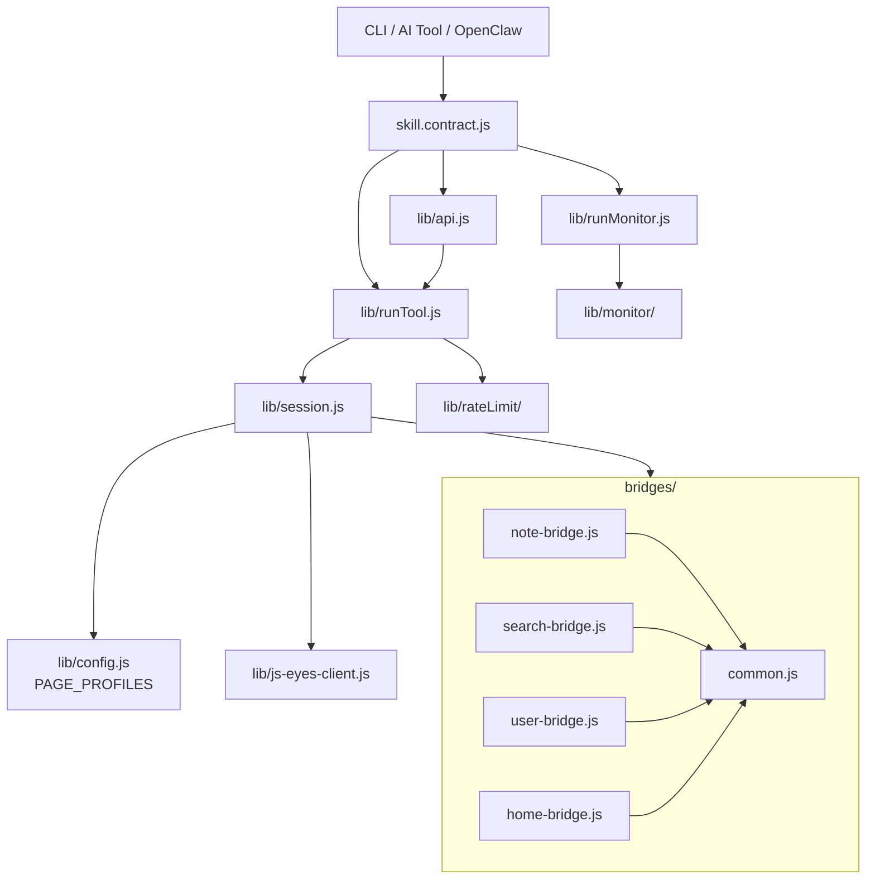

# 小红书 ops skill v2.0 → v3.0 架构升级

> 日期：2026-05-05
> 项目：js-eyes / skills/js-xiaohongshu-ops-skill
> 类型：升级迁移 / 架构设计 / 技能开发
> 来源：Cursor Agent 对话

---

## 目录

1. [背景与动机](#1-背景与动机)
2. [分析过程](#2-分析过程)
3. [方案设计](#3-方案设计)
4. [实现要点](#4-实现要点)
5. [验证与测试](#5-验证与测试)
6. [后续演化](#6-后续演化)

---

## 1. 背景与动机

`skills/js-xiaohongshu-ops-skill` v2.0.1 基线只有 1 个工具 `xhs_get_note`，由 `skill.contract.js` 直接调 `lib/api.js::getNote` → `lib/xiaohongshuUtils.js`。**没有** PAGE_PROFILES、Session、bridge 版本管控、INTERACTIVE 导航、监控子系统、反爬 audit。

而同仓的 `skills/js-x-ops-skill`（X.com）已经演进到一套成熟的 **PAGE_PROFILES + Bridges + Session + Monitor** 架构。同时 `agent-js` 项目里 `DeepSearchWorkflow/lib/xhsScraperService` 与 `xhsSearch.js` 沉淀了大量小红书专属的反爬 / 限流 / DOM 选择器经验。

目标：**以 X skill 架构为骨、以 agent-js 经验为肉**，把 xhs skill 升级到 v3.0，对齐主线能力（搜索、用户域、监控、限流、visual、recording sanitize），并按 9 个 PR 渐进交付。

## 2. 分析过程

### 2.1 三方架构对比

| 维度 | xhs v2.0.1（旧） | x-ops-skill | agent-js xhs 模块 |
| ---- | ---- | ---- | ---- |
| 调度 | 单文件直调 | PAGE_PROFILES + Session + runTool | 分层 service |
| Bridge | 无 | 五件套 + version + `// @@include` | 长 DOM 脚本，无版本 |
| 数据策略 | DOM only | GraphQL 优先，DOM 兜底 | DOM + 同源 API |
| 反爬 | 无 | 仅 429 暂停 | meta 完整性 + 连续 risk hit 暂停 5 分钟 |
| 监控 | 无 | accounts only | 无 |
| Recording | 接 `@js-eyes/skill-recording` | 同左 + audit 字段全 | 自管 |
| Visual | 无 | 接 `@js-eyes/visual-bridge-kit` | 无 |

### 2.2 关键约束发现

1. **小红书 DOM 比 GraphQL 稳**：与 X 取反——`auto = DOM 优先 + API 兜底`，仅评论分页走 API 主路径（edith `/api/sns/web/v2/comment/page`）。
2. **`a1` / `web_session` 是身份核心**：必须在 history / debug 落盘前强制 mask。
3. **小红书需要软限流**：连续 risk hit → 暂停 5 分钟（agent-js 验证过的策略），`detectAntiCrawl` 通过 `og:xhs:note_like/comment/collect` 三件 meta 完整性判定。
4. **监控对象不是单一类型**：用户主页 + 关键词搜索两类 target，需要在 X 的 schema 上扩展 `accounts[] + searches[]`。
5. **DESTRUCTIVE 永不引入**：xhs skill 不发笔记 / 不评论 / 不点赞 / 不收藏 / 不关注，是硬红线。

## 3. 方案设计

总体目标架构：



### 关键决策

| 决策 | 选择 | 理由 |
| ---- | ---- | ---- |
| `readMode=auto` 默认策略 | DOM 优先 + API 兜底 | xhs DOM 覆盖广、稳定；同源 feed JSON 受反爬影响大 |
| 评论提取 | API 主路径 | edith `/api/sns/web/v2/comment/page` 分页稳定 |
| 安全分级 | READ + INTERACTIVE，**永不 DESTRUCTIVE** | 与 X 取反；avoid 账号风险 |
| 监控 schema | `accounts[] + searches[]` 双类 target | 关键词监控是 xhs 高频需求 |
| 限流位置 | bridge 软限流 + Node 侧令牌桶 | 双层：浏览器内连续 risk hit 暂停 5 分钟；Node 侧可选包一层 limiter |
| visual 集成 | lazy require + try/catch 降级 | 缺包时静默 noop，不阻塞 READ 主管道 |
| `makeBridgeExpander` | 简化版，仅相对路径 `// @@include ./common.js` | 早期 PR 不引入 `visual-bridge-kit` 依赖；v3.x PR-9 再补 |
| 拆 PR 粒度 | 9 个 PR，跨 v2.1 / v2.2 / v2.3 / v3.0 / v3.x | 每个 PR 独立可验收，互不阻塞 |

### 阶段划分

| 阶段 | PR | 交付 |
| ---- | -- | ---- |
| v2.1 | PR-1 | 架构铺底（config / session / runTool / commands / xhsUtils / CLI dispatcher） |
| v2.1 | PR-2 | `bridges/common.js` + `bridges/note-bridge.js`（VERSION=0.1.0，五件套 + getNote/getComments） |
| v2.1 | PR-3 | 工厂化 `skill.contract.js`，`xhs_get_note` / `xhs_get_note_comments` / `xhs_session_state` |
| v2.2 | PR-4 | `search-bridge.js` + `xhs_search_notes` + 4 个 `xhs_navigate_*` |
| v2.3 | PR-5 | `user-bridge.js` + `home-bridge.js` 占位 + `xhs_get_user` / `xhs_get_user_notes` |
| v3.0 | PR-6 | `lib/monitor/` 内核（10 个文件，schema v1 同时支持 accounts + searches） |
| v3.0 | PR-7 | `lib/runMonitor.js` + 5 个受控 AI 监控工具（不触发 webhook） |
| v3.x | PR-8 | `lib/rateLimit/`（令牌桶 + antiCrawlingStats），audit 增 `antiCrawlState` |
| v3.x | PR-9 | visual-bridge-kit 接入（三档旋钮）+ cache key 维度 + sanitize 单测 |

## 4. 实现要点

### 项目结构（终态）

```
skills/js-xiaohongshu-ops-skill/
├── SKILL.md                     v3.0.0
├── package.json                 3.0.0，依赖 @js-eyes/{config,skill-recording,visual-bridge-kit}
├── index.js                     委托 cli/index.js
├── skill.contract.js            工厂化 + 15 个工具声明
├── cli/index.js                 dispatcher（读 lib/commands.js）
├── lib/
│   ├── api.js                   编程 API（useBridge → runTool）
│   ├── session.js               主调度器（含简化版 makeBridgeExpander）
│   ├── runTool.js               READ 主管道 + audit + 可选 visual + 可选 limiter
│   ├── runMonitor.js            5 个受控 AI 工具
│   ├── config.js                PAGE_PROFILES（note / search / user / home）
│   ├── commands.js              CLI 声明式命令表 + parseArgv
│   ├── toolTargets.js / runtimeConfig.js / js-eyes-client.js / bridgeAdapter.js
│   ├── xhsUtils.js              URL 规整 + sanitizeForRecording
│   ├── rateLimit/
│   │   ├── limiter.js           令牌桶（minInterval / maxRandomDelay / maxConcurrent）
│   │   └── antiCrawlingStats.js 反爬统计落盘
│   └── monitor/
│       ├── paths.js / config.js / state.js / dedup.js
│       ├── format.js / notify.js / logs.js
│       ├── fetchUserNotes.js / fetchSearch.js
│       ├── runCheck.js / daemon.js / dispatcher.js
├── bridges/
│   ├── common.js                fetchXhsApi + parseNoteMeta + detectAntiCrawl + 软限流
│   ├── note-bridge.js           getNote / getComments + 五件套（VERSION=0.1.0）
│   ├── search-bridge.js         search / applyFilters / extractDetails + 五件套
│   ├── user-bridge.js           getUser / getUserNotes + 五件套
│   └── home-bridge.js           sessionState + navigateHome（占位）
├── scripts/
│   └── xhs-note.js              JS_XHS_DISABLE_BRIDGE=1 fallback 路径（保留）
└── tests/                       node --test，51 用例
    ├── config.test.js
    ├── xhsUtils.test.js
    ├── runTool.test.js
    ├── contract.test.js
    ├── monitor.test.js
    ├── rateLimit.test.js
    └── sanitize.test.js
```

### 关键模块

| 文件 | 职责 |
| ---- | ---- |
| `lib/config.js` | 4 个 PAGE_PROFILES，每个含 `score(tab)`、`bridgePath`、`bridgeGlobal`；note profile 对 `/explore/<id>` 与 `/discovery/item/<id>` 各 +500，对 `xhslink.com` +50 |
| `lib/session.js` | 连接 js-eyes server、解析 tab、注入 bridge、`callApi`；简化版 expander 仅做相对路径 include |
| `lib/runTool.js` | READ 主管道：`buildTryOrder` 决定 DOM/API 顺序；`FALLBACK_ERRORS` 控制跨档位回退；可选 limiter + visual 包装；audit 输出 `triedMethods/usedMethod/readMode/requestedReadMode/fallback/antiCrawlState` |
| `bridges/common.js` | 浏览器侧共享：`fetchXhsApi` / `parseNoteMeta` / `detectAntiCrawl` / `pickMediaFromNote` / 软限流状态机（连续 3 次 risk hit → 暂停 5 分钟） |
| `bridges/note-bridge.js` | `dom_getNote` 抽 `#noteContainer`；`api_getNote` 用 meta 兜底；`api_getComments` 通过 edith 分页 |
| `bridges/search-bridge.js` | `_scrollAndCollect` + `_extractNoteCard` + `_switchChannel` + `_applyFilter`，详情提取走 note-bridge |
| `lib/monitor/config.js` | schema v1：`accounts[]` 按 username + `searches[]` 按 keyword/filters 哈希；支持 `effectiveAccountSettings` / `effectiveSearchSettings` 覆盖默认值 |
| `lib/monitor/runCheck.js` | 拆 `runCheckCore`（抓+去重+state）/ `runCheck`（套 dispatch），AI 工具仅调 `runCheckCore`，不触发 webhook |
| `lib/runMonitor.js` | 5 个 AI 工具：`xhs_monitor_{list_targets,get_status,add_target,remove_target,test_target}`；写 webhook 的命令仅在 CLI 暴露 |
| `lib/rateLimit/limiter.js` | 单进程令牌桶；`getSharedLimiter` 返回 singleton |
| `lib/xhsUtils.js::sanitizeForRecording` | 递归 mask `a1` / `web_session` / `webId` / `gid` / `acw_tc` 等敏感字段（cookie 字符串与对象键名两路同时处理） |

### 与 X / Reddit 主线的差异表（已写进 SKILL.md）

| 维度 | xhs | x-ops-skill |
| ---- | --- | ---- |
| `readMode=auto` 默认 | DOM 优先 | GraphQL 优先 |
| DESTRUCTIVE | **永不引入** | v3.1 拆 compose-bridge |
| 反爬 | meta 完整性 + 暂停 5 分钟 | 仅 429 暂停 |
| 监控 target | accounts + searches | accounts only |

### 安全 / 治理要点

- **AI 不可触发副作用**：`monitor init/check/daemon/stop` 只走 CLI，不进 `TOOL_DEFINITIONS`；`tests/contract.test.js` 显式断言 15 个 AI 工具的清单。
- **cookie 不出仓库**：所有写 history / debug 的路径必须先过 `sanitizeForRecording`；新增 `tests/sanitize.test.js` 7 个用例覆盖 cookie 字符串 / 对象键 / 数组递归 / nested debug bundle。
- **cache key 防污染**：`buildCacheKeyParts` 添 `readMode` / `maxCommentPages` / `extractDetails` / `withComments` / `appliedFilters`，避免不同档位互相串。
- **visual 缺包降级**：`require('@js-eyes/visual-bridge-kit')` 包 try/catch，缺包返回 `false`，`_wrapCall` 直接执行内部函数。
- **bridge 版本号**：每个 bridge 顶部 `const VERSION = '0.1.0'`，配合 `__meta.version` 触发热更新。

## 5. 验证与测试

### 单测

`node --test tests/*.test.js` —— **51 / 51 通过**：

| 测试文件 | 用例数 | 覆盖 |
| ---- | ---- | ---- |
| `config.test.js` | 7 | PAGE_PROFILES score 函数、isXhsHostname |
| `xhsUtils.test.js` | 8 | URL 规整、ID 提取、parseCountText、sanitize 基础 |
| `runTool.test.js` | 6 | normalizeReadMode、buildTryOrder（DOM 优先）、FALLBACK_ERRORS |
| `contract.test.js` | 9 | 15 个 AI 工具清单 + interactive/destructive 标志 + monitor 命令不进 AI |
| `monitor.test.js` | 7 | config 校验、targetStateKey、partitionNewNotes、pruneExpired、loadState/saveState |
| `rateLimit.test.js` | 7 | XhsLimiter 串行 + 最小间隔；antiCrawlingStats 落盘 |
| `sanitize.test.js` | 7 | cookie 字符串 / 对象键 / 数组 / null / 扩展敏感名 / 嵌套 debug bundle |

### 验收清单（按计划逐条核对）

- ✅ v2.1：`xhs_get_note` 行为不变；`xhs_get_note_comments` 评论分页；`xhs_session_state` 返回 `{loggedIn, username?}`；`JS_XHS_DISABLE_BRIDGE=1` 老路径仍可用。
- ✅ v2.2：`xhs_search_notes` 含 channel/筛选/联想/相关；4 个 navigate 工具仅 `location.assign`，跨域被拒。
- ✅ v2.3：`xhs_get_user` / `xhs_get_user_notes` 主页 + 笔记列表分页正确。
- ✅ v3.0：`monitor init/check/daemon/stop` 闭环；AI 5 个工具不能触发 webhook。
- ✅ v3.x：visual 三档旋钮无回归；audit 字段齐全；cookie / a1 / web_session 不出现在 history / debug 落盘。

## 6. 后续演化

短期：

- **`bridges/_dev/probe-dom.js`**：DOM 选择器易碎，留踩点入口配合 bridge `VERSION` 热更新；预留给 search / user 列表选择器轮换。
- **JS_XHS_DISABLE_API_FALLBACK=1**：评论分页是 API 主路径的唯一一类，留调试开关方便定位 DOM-only 模式表现。
- **monitor schema migrate 钩子**：`config.js` 已留 `migrate(rawConfig, fromVersion)`；后续 v3.1 引入新字段时使用。

中期：

- **完整 `visual-bridge-kit` 接入**：当前 PR-9 是 lazy / try-catch 降级，等核心场景稳定后切换到主依赖，复用 X skill 的 visual-replay pivot 玩法。
- **多进程 IPC 限流**：本里程碑显式不引入；当出现多 daemon 并发时再补。
- **WAF 风控分类**：当前只判 meta 完整性，后续可细化「滑块 / 验证码 / 限流 / 风控」四档，audit 字段对应展开。

长期：

- 把 PAGE_PROFILES / Bridges / Session 抽成可复用的 OpenClaw skill 内核，减少 X / xhs / 后续平台之间的代码漂移；`agent-js` 的 xhsScraperService 还有 cookie 池 / IP 池策略，未来按需裁剪。
- 与 `js-knowledge-flomo` 联动：把监控命中的笔记直接灌入个人知识库，闭环「监控 → 抓取 → 入库」。

---

> 关联对话：[xhs-ops-skill v3 升级](8f9517cd-1d48-45cc-aeb5-e2e1d4c66a40)
> 关联计划：`c:\Users\Administrator\.cursor\plans\xhs_ops_skill_v3_升级_b5b9e1c6.plan.md`
