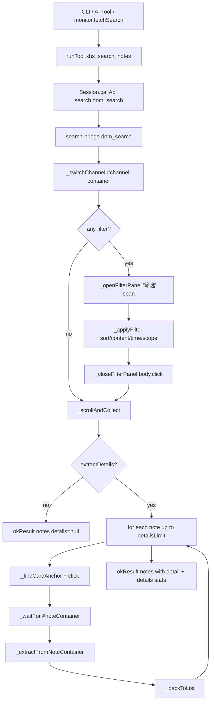

# xhs `xhs_search_notes` v3.2：注入路径对齐 + 串行点开详情

> 日期：2026-05-05（Tue）
> 项目：js-eyes / skills/js-xiaohongshu-ops-skill
> 类型：增强 / 行为对齐
> 来源：Cursor Agent 对话；参考实现见 `agent-js/.claude/skills/js-workflow/executor/workflows/DeepSearchWorkflow/lib/mcp/tools/xhsSearch.js`

---

## 1. 动机

v3.1 完工后实跑发现，`xhs_search_notes` 在 `search-bridge.js (0.2.1)` 上有两类与线上 DOM 不符的实现：

1. **筛选 / 频道交互路径**：走的是 `.filter-group:nth-of-type(n) .dropdown-*` 与 `.search-channel-list li`，但线上结果页的真实结构是 `#channel-container`（频道）+ 「筛选」span 触发 `.filters-wrapper`（参考 agent-js 内已经跑通的 `xhsSearch.js`）。结果是开筛选总不生效，已知日记 issue #7 也踩过同类 selector 假设错误。
2. **`extractDetails` 是占位**：`_extractDetails` 只把 `detailExtractedInline:false` 打回，并把抓详情的责任推给「调用方再串 `note-bridge`」。这与 agent-js 参考脚本「同 tab 点 `a.cover` → 抽完 → 点 `.close-circle .close` 返回」的语义相差很远。

本次对齐：**注入仍走 bridge**（与 v3 主线一致：版本号、热更新、common.js 共享、审计/限流），把参考脚本里**已验证**的交互顺序与等待节奏迁移进 bridge；`extractDetails` 升级为「同 tab + back 串行抽取」。

## 2. 方案

### 2.1 范围

| 文件 | 改动 |
| ---- | ---- |
| [bridges/search-bridge.js](../../skills/js-xiaohongshu-ops-skill/bridges/search-bridge.js) | VERSION 0.2.1 → **0.3.2**（0.3.0 落地 + 0.3.1/0.3.2 实战补丁，详见 §4）；重写 `_switchChannel` / `_openFilterPanel` / `_applyFilter` / `_closeFilterPanel`；新增 `_extractDetailInline` / `_extractFromNoteContainer` / `_findCardAnchor` / `_backToList`；`dom_search` 串行编排 + `details` 统计 |
| [skill.contract.js](../../skills/js-xiaohongshu-ops-skill/skill.contract.js) | `xhs_search_notes` 暴露 `detailsLimit`；描述更新；`timeoutMs` 180s → 360s |
| [lib/commands.js](../../skills/js-xiaohongshu-ops-skill/lib/commands.js) | CLI `search` 加 `--details-limit`，help 更新 |
| [lib/runTool.js](../../skills/js-xiaohongshu-ops-skill/lib/runTool.js) | `buildCacheKeyParts` 加入 `detailsLimit` 维度 |
| [lib/monitor/fetchSearch.js](../../skills/js-xiaohongshu-ops-skill/lib/monitor/fetchSearch.js) | 透传 `extractDetails / detailsLimit`；`timeoutMs` 跟随上调到 360s |
| [lib/monitor/config.js](../../skills/js-xiaohongshu-ops-skill/lib/monitor/config.js) | `effectiveSearchSettings` 默认 `extractDetails:false`，可在 search 项里显式覆盖 |
| [scripts/_dev/probe-search.js](../../skills/js-xiaohongshu-ops-skill/scripts/_dev/probe-search.js) | 探测脚本扩到「频道 / 筛选面板 / 详情弹窗」三组，验证「同 tab + back」假设 |
| [tests/search.test.js](../../skills/js-xiaohongshu-ops-skill/tests/search.test.js) | 新增 8 用例（VERSION / 编排关键函数 / detail.error 不中断 / cache key / contract / monitor / parseArgv） |
| [SKILL.md](../../skills/js-xiaohongshu-ops-skill/SKILL.md) | 新增「`xhs_search_notes`（v3.2）」段：UI 路径表 + 命令样例 + 返回结构 + 风控注意 |

不改：`note-bridge` 详情抓取逻辑（保持单一来源）、`runMonitor` / `runCheck` / limiter / visual 接入 / 用户域。

### 2.2 关键决策

| 决策 | 选择 | 理由 |
| ---- | ---- | ---- |
| 详情抽取放在哪里 | search-bridge 内部 `_extractFromNoteContainer`（thin extract，字段命名与 `note-bridge::dom_getNote` 严格对齐） | 跨 bridge 调 `__jse_xhs_note__` 在 IIFE 注入时机 / 作用域不保证。本次最小破坏；下一个 PR 再把 `extractNoteFromContainer(rootEl)` 下沉到 [bridges/common.js](../../skills/js-xiaohongshu-ops-skill/bridges/common.js)，两个 bridge 用 `// @@include` 共用 |
| 串行点开方案 | 同 tab：点带 `xsec_token=` 的 `<a>` → 等 `#noteContainer` → 抽 → `.close-circle .close`（备 `history.back()`）→ 等 `.feeds-container .note-item` 重出现 | 与参考 `xhsSearch.js` 的 `extractNoteDetails` 语义一致；新开 tab 隔离更干净但开销大、监控场景不友好 |
| 多排序 sweep（2a） | 暂不做 | 默认先 2b（单次搜索 UI 路径对齐）；`sortByList` 多轮去重作为后续可选增强，避免默认路径变慢 / 风控 |
| `detailsLimit` 默认 | `min(notes.length, limit)`，硬上限 20 | 防止 AI 误传巨大值；建议 ≤10 |
| monitor 默认 `extractDetails` | `false` | 长跑场景保守，可在 search 项 JSON 里显式 `"extractDetails": true, "detailsLimit": 5` 开启；monitor 内部把 `timeoutMs` 自动从 240s 上调到 360s |

### 2.3 核心流程

## 3. 风险与回滚

- **详情走新 route 而非模态**：探测脚本会先验证；bridge 在拿不到 `#noteContainer` 时自动 `history.back()` 并把 `detail.error: 'route_navigated'` 透出，不破坏主路径。
- **多次开关筛选面板触发风控**：每个交互后保留 `_randomJitter(800-1200)`；命中 `recordRiskHit` 软限流。
- **回滚单元**：`bridges/search-bridge.js` VERSION 回到 `0.2.1` 即可热更新到旧版（version 不匹配触发重注入）；contract / monitor / cache key 改动均向后兼容（新增字段，旧调用方不受影响）。

## 4. 验证

- `node --test tests/*.test.js` → **96 / 96 通过**（v3.1 收尾 88 + v3.2 新增 8）。
- 新增的 8 个用例覆盖：
  - VERSION ≥ 0.3.0；不再使用旧 selector（`.search-channel-list li` / `.filter-group:nth-of-type`）。
  - 编排关键函数齐全（`_switchChannel` / `_openFilterPanel` / `_applyFilter` / `_closeFilterPanel` / `_extractDetailInline` 等）。
  - `_extractDetailInline` 三类失败码（`card_anchor_not_found` / `no_note_container` / `route_navigated`）显式存在于源码 → 不抛错。
  - CLI `parseArgv` 与 `COMMANDS.search.toArgs` 串通 `--details-limit`。
  - monitor `effectiveSearchSettings` 默认 `extractDetails:false` 且严格 `===true` 才生效；`detailsLimit` 透传。
  - skill.contract.js `xhs_search_notes.parameters.properties.detailsLimit` 暴露。
  - runTool `buildCacheKeyParts` 含 `extractDetails / detailsLimit` 维度。

实战验收（已执行）：

| 步骤 | 命令 | 实测结果 |
| -- | -- | -- |
| 1 | `xhs search "美食" --limit 5 --extract-details --details-limit 3 --json` | duration 10.7s；`details = {requested:3, succeeded:3, failed:0}`；3 条详情全字段：desc 263–959 chars，image_urls 8–11，stats 完整（`1.4万 → 14000` 解析正确） |
| 2 | `xhs search "美食" --sort-by 最新 --json` | `appliedFilters.sortBy='最新'`，`filterPanelUsed=true`；首条 noteId `69e84f75…` > 综合首条 `6936473d…`（noteId 前 8 位 hex 是时间戳，更新者更大），排序真生效 |
| 3 | monitor `searches[].extractDetails=true` 跑 1 轮 check | 待长跑验证 |

### 实战中追加的 2 个 bridge 补丁（0.3.0 → 0.3.1 → 0.3.2）

| 版本 | 现象 | 根因 | 修复 |
| ---- | ---- | ---- | ---- |
| 0.3.0 → 0.3.1 | 详情 `detail.ok=true` 但 `desc.len=0`、`image_urls=1`、`stats.likes=7`（实际 3567） | xhs 实测点开走的是**新 route `/explore/<id>`**（不是模态），container 是 `.note-container`；旧 selectors 全部 `#noteContainer` 前缀全 miss，fallback 抓到了 `.like-wrapper .count` 的第一个匹配（外部小组件而非 engage-bar）；`.close-circle .close` 在路由模式下根本不存在 | `_extractFromNoteContainer`：把所有 `pickCount` 改为「container 内查找」，去掉 `#noteContainer` 前缀；description selector 从 `.note-content .desc` 放宽到也接受 `.note-content` 直读；新增 meta `og:xhs:note_*` 兜底。`_backToList`：检测 `routeMode = !/\/search_result/.test(location.pathname)`，路由模式下强制 `history.back()` 不点 close 按钮 |
| 0.3.1 → 0.3.2 | 修了 selector 后 note[1]/note[2] 完美，但 note[0]（首条）仍 `desc.len=25`、`stats=null`、`imgs=1` | 第一条点开后只等了 `_waitFor(#noteContainer, 8000)` + `_randomJitter(400-700)`，但 swiper 与 engage-bar 还在 lazyload | 新增 `await _waitFor('.engage-bar .like-wrapper, .like-wrapper .count', 3000)`；`_randomJitter` 提到 600-1000ms |
| 0.3.2 → 0.3.5 | 多筛选实测 `appliedFilters` 三项全 `applied=true` 但**列表完全没换**（首条 noteId 与 `--sort-by 综合` 一致，likes 也不降序） | xhs 用 **Vue（`data-v-eb91fffe`）不是 React**；`__reactProps$` 无；同时 visual-bridge-kit 给每个 `.tags` 装了一层 `position:absolute; opacity:0.00001; pointer-events:auto` 的 **HP overlay**（`button-hp-installed=1` `data-hp-kind=filter-tag-...`），出现在 `querySelectorAll` 顺序的前面 → 我们 click 的是 overlay 不是真实 Vue 节点；`activeText` 也读到 overlay 的镜像 active class，于是「没改成功」根本就是 false-positive。0.3.4 加 `*_activated` 字段后该 `false` 暴露 | `_applyFilter` / `_switchChannel` 全部改用 `[data-hp-bound]` 选择真 Vue 节点（fallback 跳过 `[data-hp-installed]`）；新增 `_realActiveText` 仅看 `[data-hp-bound].active` 判定 React/Vue 状态机已切；contract `sortBy` 加 `enum: ['综合','最新','最多点赞','最多评论','最多收藏']`，把之前误写的「最热」剔掉 |
| 0.3.5 → 0.3.6 | CLI 默认开 visual 后头尾各 1 个 HUD（pending → success），但中段 ~16s 串行详情**完全无任何 HUD/flash**，肉眼看像「visual 没了」。eventsCount 只有 15 (2 hud + 1 before + 10 flash + 1 after + 1 frame) | runTool 的 `wrapCallApi` 只在「整次 bridge 调用」头尾 emit 一次 HUD；中间所有 click flash 来自 HP overlay 自动镜像，但**不会** emit 文字进度 | bridge 内通过 `window.__jse_visual` (visual-bridge-kit 暴露的 in-page API) 在 5 个关键节点主动 emit HUD：`_switchChannel` / `_openFilterPanel` / `_applyFilter`（每个筛选项都 pending→success）/ `_extractDetailInline`（每条 `点开 / 等互动栏 / imgs=N likes=M / 回列表` 4 段）。同时给 hit element 加 `flashElement` 高亮。19s 流程从 15 events → **42 events（22 HUD + 17 flash）**，每 ~1s 一次进度更新 |
| 0.3.6 → 0.3.7 | 5/5 详情成功 + likes 对账完全一致后，发现 `n.type` 一直是 `-`、`detail.publishTime` 一直为空 —— 之前没抽这两个字段 | 卡片层从未读 `.play-icon`；详情层 `.date` 节点既出现在笔记自己（位于 `.note-content` 一带）又出现在每条 `.comment-item` 里，没区分就拿不到笔记自身时间 | `_extractNoteCard`：检 `a.cover .play-icon, [class*="play-icon"], video` 标记 `type: 'video' \| 'normal'`。`_extractFromNoteContainer`：扫 `container.querySelectorAll('.date')`，跳过 `closest('.comment-item, .comments-container')`，第一个非 comment 的 `.date` 解析为 `publishTime` + `publishLocation`（正则拆「编辑于? <时间块> [省市]」，时间块兼容 `MM-DD / YYYY-MM-DD / 昨天 HH:MM / N天前 / N小时前 / 刚刚` 等）。视频频道 4/4 type=video，最多点赞+一周内 详情全有 publishTime（`刚刚 / 3天前`）+ location（`福建 / 意大利`） |

### probe 直接证实的关键事实

[scripts/_dev/probe-search.js](../../skills/js-xiaohongshu-ops-skill/scripts/_dev/probe-search.js) 加了三组探测（频道 / 筛选面板 / 详情容器），实跑直接 dump 出：

- `#channel-container` 存在但内部是单一 `.content-container` div，子元素文本拼接为 `"全部 图文 图文 视频 视频 用户 用户"` —— 说明频道 Tab 不是 `<button>` 而是嵌套 `
` 叶子；我的 fallback「`children.length===0 && textContent === channelType`」必要。
- `.filters-wrapper` 在面板未开时不存在；触发器候选有两个，第一个是 `.filter` 容器 div（childCount=2），第二个是空 class 的 ``（childCount=0）—— 我的「优选 leaf span」策略命中正确。
- 点开详情后 `containerCls` 实测是 `.note-container`（不是 `#noteContainer`），URL 是 `/explore/<id>` 完整路由 —— 直接证伪了「同 tab 模态」假设。这就是为什么 0.3.1 必须扩兼容容器与 `_backToList` 路由分支。
- 筛选面板每个选项 outerHTML 里两份 `.tags`：第一份带 `button-hp-installed="1" data-hp-kind="filter-tag-综合" style="position:absolute; opacity:0.00001; pointer-events:auto"`（visual-bridge-kit 的点击映射层，**没有** `data-v-eb91fffe`），第二份才是 `data-v-eb91fffe data-hp-bound="1"` 的真 Vue 节点。`elementFromPoint(x,y)` 在视觉中心拿到的可能是 overlay 的 ``，但 click() 不会触发 Vue onChange。`tag.click()` / `span.click()` / `dispatchEvent(MouseEvent)` / `pointerdown+mouseup+click` 全跑过 —— 只有点 `[data-hp-bound]` 的 Vue 节点才真正切 active。

### CLI Visual & 默认行为

- `cli/index.js` 里 `--no-visual` 变成显式开关：默认 visual ON（与 `js-x-ops-skill` 对齐），HUD/flash/before/after 11~15 个 events，`framesEnabled` 仍由 `--visual-record` 控制（避免无脑录大文件）。
- `lib/commands.js` 里 `--visual-trace` 改为「下个参数以 `-` 开头则视为 truthy」，与 `--visual-record` 同款 smart-eat —— 之前会把 `--visual-trace --json` 中的 `--json` 当成 trace 路径写进文件。
- 监控不受影响：`lib/monitor/fetchSearch.js` 不传 `visualConfig`，`runTool` 自动 noop。

## 5. 后续

- **下沉 `extractNoteFromContainer`**：把 `_extractFromNoteContainer` 抽到 [bridges/common.js](../../skills/js-xiaohongshu-ops-skill/bridges/common.js)，`note-bridge` 与 `search-bridge` 通过 `// @@include` 共用，避免详情抽取逻辑双份维护。
- **多排序 sweep（2a）**：在 `xhs_search_notes` 增加 `sortByList: string[]`，串行扫多个排序轮次并按 noteId 去重；引入 `sortPass` audit 字段。
- **WAF 风控分类联动**：详情阶段连续 `card_anchor_not_found` ≥ N 次时触发软限流。

---

> 关联日记：[xhs-ops-skill v3 升级](xhs-ops-skill-v3-upgrade.md)
> 关联计划：`c:\Users\Administrator\.cursor\plans\xhs_search_inject_+_serial_details_ae5660e7.plan.md`
