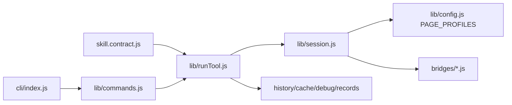

# js-zhihu-ops-skill 升级与真实浏览器验证

> 日期：2026-05-06
> 项目：js-eyes / js-zhihu-ops-skill
> 类型：架构设计 / 功能实现 / 问题排查 / 升级迁移 / 技能开发
> 来源：Cursor Agent 对话

---

## 目录

1. [背景与动机](#1-背景与动机)
2. [分析过程](#2-分析过程)
3. [方案设计](#3-方案设计)
4. [实现要点](#4-实现要点)
5. [验证与测试](#5-验证与测试)
6. [后续演化](#6-后续演化)

---

## 1. 背景与动机

本次对话起点是希望参考 `skills/js-xiaohongshu-ops-skill` 的架构和功能，评估如何升级 `skills/js-zhihu-ops-skill`。最初要求是“分析后说下思路，不要执行，不要代码”，因此先只读对比两个 skill 的目录、`SKILL.md`、`skill.contract.js`、`package.json`、CLI 和运行层文件。

对比结果显示：

| 维度 | `js-xiaohongshu-ops-skill` | `js-zhihu-ops-skill` 升级前 |
| ---- | ---- | ---- |
| 架构 | `PAGE_PROFILES + Session + Bridges + runTool + commands` | 脚本直连 `BrowserAutomation + getTabHtml + cheerio` |
| 工具面 | 笔记、评论、搜索、用户、首页、导航、monitor | 仅回答与专栏详情 |
| 安全分级 | 明确 READ / INTERACTIVE / DESTRUCTIVE | 未显式标注 |
| 诊断能力 | `session-state`、`doctor`、`records` | 无 |
| 治理能力 | recording、visual、rate-limit、anti-crawl、monitor | 只有基础 recording |
| 测试 | 多组 `node --test` | 无测试目录 |

随后用户要求“制定实施计划”，因此根据模板化 plan 模式生成了 `Zhihu Skill Upgrade` 计划，但不编辑业务代码。计划被用户确认后，又要求按计划完整实现，不停止直到所有 todo 完成。

本次实际目标由此明确为：将 `js-zhihu-ops-skill` 从轻量脚本型工具升级为与小红书 skill 同类的可维护 ops skill，并在用户后续启动 server 和浏览器插件后，完成真实浏览器抓取验证。

## 2. 分析过程

### 2.1 初始只读调研

调研阶段读取了以下关键文件：

| 文件 | 发现 |
| ---- | ---- |
| `skills/js-xiaohongshu-ops-skill/SKILL.md` | 小红书 skill 已沉淀安全分级、readMode、monitor 红线、visual、recording、doctor、records 和架构说明 |
| `skills/js-zhihu-ops-skill/SKILL.md` | 知乎 skill 只声明 `zhihu_get_answer`、`zhihu_get_article` 和基础 recording |
| `skills/js-xiaohongshu-ops-skill/skill.contract.js` | 使用工厂化 executor、显式 `interactive/destructive`、READ 与 navigate 分离 |
| `skills/js-zhihu-ops-skill/skill.contract.js` | 直接调用 `getAnswer/getArticle`，无 `Session`、无 bridge、无安全标记 |
| `skills/js-zhihu-ops-skill/lib/api.js` | 负责 recording/cache/debug，并调用 `scrapeZhihuAnswer/Article` |
| `skills/js-zhihu-ops-skill/lib/zhihuUtils.js` | 通过 `getTabHtml` + cheerio 解析回答/专栏 |
| `skills/js-zhihu-ops-skill/cli/index.js` | 只是 spawn `index.js`，没有声明式命令分派 |

关键结论：知乎 skill 当前不是“多 profile ops skill”，而是“两个页面抽取脚本的包装”。如果直接堆搜索、用户、监控，会把复杂度继续压到脚本层，后续难维护。因此升级顺序应先迁移架构底座，再扩展功能面。

### 2.2 实施计划

计划分六个阶段：

1. 架构底座对齐：新增 `PAGE_PROFILES`、`Session`、`bridges`。
2. 统一 READ 管道与 contract：新增 `runTool`，明确安全分级。
3. CLI 声明式改造：新增 `commands.js`，重构 `cli/index.js` 和 `index.js`。
4. 功能面扩展：新增 question、search、user 相关工具。
5. 可观测性与治理：records、visual 元数据、anti-crawl、rate-limit、monitor。
6. 测试与验收：补 contract、URL、CLI、extractor、bridge、monitor 测试。

### 2.3 真实验证中的问题排查

用户随后说明 server 和浏览器插件已经开启，要求做真实浏览器抓取验证。首次运行：

```powershell
node index.js session-state --pretty --no-cache --timeout-ms 60000
```

先后暴露出几个真实环境问题：

| 现象 | 根因 | 修复 |
| ---- | ---- | ---- |
| WebSocket `Unexpected server response: 401` | 知乎 skill 内的 `lib/js-eyes-client.js` 没有读取 server token | 补 `options.token` / `JS_EYES_TOKEN` / `~/.js-eyes/runtime/server.token` / `~/.js-eyes/secrets/server-token`，并加 `Origin: http://localhost` |
| `规则引擎拒绝此操作（soft-block）` | server 策略 `L4a-task-origin` 拒绝对后台知乎 tab 执行脚本 | 将知乎域加入 egress allowlist，并修正 `Session` 复用任意知乎 tab 时优先 active tab |
| `answer` 对一个旧公开 URL 返回 `dom_navigation_required` | 该 URL 被知乎重定向到问题荒原页，不是有效回答样本 | 从真实用户回答列表抓取有效回答 URL 后重测 |
| `answer` 导航后仍停在首页 | page-world `location.assign` 不够可靠，host-side 未兜底 | `runTool` 在 `dom_navigation_required` 时补 `browser.openUrl(resp.to, target.rawId)` |
| `author_name` 被问题标题污染 | 作者选择器使用了全局 `meta[itemprop=name]` | `extractAuthor` 优先从 answer block 的 `data-zop.authorName` 与局部 AuthorInfo 取值 |
| `search` 返回重复文章 | 搜索 DOM 选择器过宽 | 按 `url/title` 去重 |

## 3. 方案设计

最终方案采用“小红书式骨架 + 知乎 DOM 优先”的保守设计。



### 关键决策

| 决策 | 选择 | 理由 |
| ---- | ---- | ---- |
| 架构 | 引入 `PAGE_PROFILES + Session + Bridges + runTool + commands` | 与小红书 skill 对齐，后续功能可扩展、可诊断 |
| 默认读取 | `readMode=dom` | 知乎页面内容主要由 DOM 可见内容承载，暂不依赖内部 API |
| 旧路径 | 保留 `JS_ZHIHU_DISABLE_BRIDGE=1` fallback | 避免一次性替换导致旧脚本不可用 |
| 安全边界 | READ 与 INTERACTIVE 分离，DESTRUCTIVE 不引入 | 符合 ops skill 安全模型 |
| 导航 | INTERACTIVE 只允许 `location.assign`，READ 内部可 host-side 打开目标页 | 兼顾安全语义和真实浏览器稳定性 |
| Monitor | 先做配置型轻量 monitor | 不在 AI 工具中暴露会发通知或长跑 daemon 的动作 |
| Visual | 当前先返回标准 visual 元数据字段 | 为后续完整 `visual-bridge-kit` 集成预留结构 |

## 4. 实现要点

### 项目结构

本次升级后的核心结构：

```text
skills/js-zhihu-ops-skill/
├── SKILL.md
├── package.json
├── index.js
├── skill.contract.js
├── cli/
│   └── index.js
├── lib/
│   ├── commands.js
│   ├── config.js
│   ├── js-eyes-client.js
│   ├── runMonitor.js
│   ├── runTool.js
│   ├── session.js
│   ├── toolTargets.js
│   ├── monitor/
│   │   ├── config.js
│   │   ├── dispatcher.js
│   │   └── paths.js
│   └── rateLimit/
│       └── limiter.js
├── bridges/
│   ├── common.js
│   ├── answer-bridge.js
│   ├── article-bridge.js
│   ├── question-bridge.js
│   ├── search-bridge.js
│   ├── user-bridge.js
│   └── home-bridge.js
├── scripts/
│   ├── zhihu-answer.js
│   └── zhihu-article.js
└── tests/
    ├── commands.test.js
    ├── contract.test.js
    ├── monitor.test.js
    ├── runTool.test.js
    ├── session.test.js
    ├── targets.test.js
    └── zhihuUtils.test.js
```

### 关键模块

| 文件 | 职责 |
| ---- | ---- |
| `lib/config.js` | 定义 `answer/article/question/search/user/home` 六个 `PAGE_PROFILES` |
| `lib/session.js` | 负责 tab 选择、导航校验、bridge 注入、`callApi` |
| `lib/runTool.js` | READ 工具主管道，统一 readMode、history/cache/debug、审计字段 |
| `lib/commands.js` | 声明式 CLI 命令表和参数解析 |
| `lib/toolTargets.js` | 将工具参数归一化为知乎 URL |
| `bridges/common.js` | DOM helper、sessionState、阻断识别、回答/专栏/问题/搜索/用户抽取函数 |
| `skill.contract.js` | OpenClaw 工具表，显式标注 `interactive/destructive` |
| `lib/runMonitor.js` | monitor AI 工具定义与配置操作 |
| `lib/js-eyes-client.js` | 补齐 token 解析和 `Origin` header，兼容安全加固 server |

### 新增工具面

| 工具 | 类型 | 说明 |
| ---- | ---- | ---- |
| `zhihu_get_answer` | READ | 读取知乎回答详情 |
| `zhihu_get_article` | READ | 读取知乎专栏详情 |
| `zhihu_session_state` | READ | 读取登录态、cookie 标记、登录墙/验证码状态 |
| `zhihu_get_question_answers` | READ | 读取问题标题、描述和回答摘要列表 |
| `zhihu_search` | READ | 读取搜索结果 |
| `zhihu_get_user` | READ | 读取用户主页资料 |
| `zhihu_get_user_answers` | READ | 读取用户回答列表摘要 |
| `zhihu_get_user_articles` | READ | 读取用户文章列表摘要 |
| `zhihu_navigate_*` | INTERACTIVE | 仅导航，不执行破坏性动作 |
| `zhihu_monitor_*` | READ | list/status/add/remove/test monitor 配置 |

## 5. 验证与测试

### 5.1 离线单元测试

新增 17 个 `node --test` 用例，覆盖：

| 测试文件 | 覆盖点 |
| ---- | ---- |
| `tests/contract.test.js` | contract 工具表、安全标记、platforms |
| `tests/commands.test.js` | CLI 命令表、参数解析、未知参数拒绝 |
| `tests/targets.test.js` | URL target builder |
| `tests/runTool.test.js` | readMode 归一化、tryOrder |
| `tests/session.test.js` | bridge include 展开、URL 等价判断 |
| `tests/monitor.test.js` | monitor config 生命周期 |
| `tests/zhihuUtils.test.js` | 旧脚本 extractor 兼容字段 |

执行结果：

```powershell
npm test
```

最终结果：17/17 通过。

同时执行了 IDE lints：

```text
ReadLints: No linter errors found
```

### 5.2 基础 CLI 与 contract 验证

```powershell
node index.js --help
node -e "const c=require('./skill.contract'); console.log(c.tools.length)"
```

结果：

- CLI help 正常输出所有 READ / INTERACTIVE / special 命令。
- contract 可加载，工具数为 19。

### 5.3 真实浏览器抓取验证

真实验证前，server 安全策略要求将知乎域加入 allowlist：

```powershell
js-eyes egress allow zhihu.com
js-eyes egress allow www.zhihu.com
js-eyes egress allow zhuanlan.zhihu.com
```

真实验证命令与结果：

| 命令 | 结果 |
| ---- | ---- |
| `node index.js session-state --pretty --no-cache --timeout-ms 60000` | 成功读取知乎首页状态，bridge 注入成功 |
| `node index.js user yevon2ou --pretty --no-cache --timeout-ms 90000` | 成功读取用户 `yevon水库` |
| `node index.js user-answers yevon2ou --pretty --no-cache --limit 3 --timeout-ms 120000` | 成功读取 3 条用户内容，并拿到有效回答 URL |
| `node index.js answer "https://www.zhihu.com/question/1933579229917843753/answer/2033488332559209236" --pretty --no-cache --timeout-ms 120000` | 成功读取回答详情，作者 `鞭临天下`、内容长度约 4861、赞同数 319、评论数 7 |
| `node index.js article "https://zhuanlan.zhihu.com/p/2031468565962936325" --pretty --no-cache --timeout-ms 120000` | 成功读取专栏详情，作者 `屋大维`、评论数 298 |
| `node index.js search "大模型" --pretty --no-cache --limit 5 --timeout-ms 120000` | 成功读取搜索结果，并完成去重修复 |
| `node index.js question-answers 1933579229917843753 --pretty --no-cache --limit 3 --timeout-ms 120000` | 成功读取问题标题、描述和 3 条回答摘要 |

### 5.4 真实验证暴露并修复的问题

| 问题 | 修复文件 | 修复结果 |
| ---- | ---- | ---- |
| WS 401 | `lib/js-eyes-client.js` | 补 token 读取与 `Origin` header，连接通过 |
| 后台知乎 tab 被 soft-block | `lib/session.js` | 复用任意知乎 tab 时优先 active tab |
| READ 导航停留在首页 | `lib/runTool.js` | `dom_navigation_required` 后增加 host-side `openUrl` fallback |
| 回答作者抽取错误 | `bridges/common.js`、`bridges/answer-bridge.js` | 作者由问题标题修正为真实作者 |
| 搜索重复结果 | `bridges/common.js`、`bridges/search-bridge.js` | 按 URL/title 去重 |

### 5.5 真实浏览器 Smoke 固化

在第一轮真实验证通过后，继续将手工命令固化为显式 opt-in 的本机 smoke：

| 文件 | 变更 |
| ---- | ---- |
| `scripts/_dev/smoke-browser.js` | 新增真实浏览器 smoke runner，顺序调用现有 CLI，不绕过 `cli/index.js` |
| `scripts/_dev/smoke-browser.samples.json` | 固化公开样本：`yevon2ou`、回答 URL、专栏 URL、`大模型`、问题 ID |
| `package.json` | 新增 `smoke:browser`，但不挂入默认 `npm test` |
| `tests/smokeBrowser.test.js` | 离线覆盖参数解析、样本加载、命令构造、JSON 解析与结果判定 |
| `SKILL.md` | 增加真实浏览器 smoke 前置条件、示例命令和样本安全边界 |

验证结果：

```powershell
npm test
npm run smoke:browser -- --help
npm run smoke:browser
```

结果：

- `npm test`：24/24 通过。
- `ReadLints`：无错误。
- 完整真实浏览器 smoke：7/7 通过，覆盖 `session-state`、`user`、`user-answers`、`answer`、`article`、`search`、`question-answers`。

### 5.6 列表分页与受控滚动升级

随后进入 READ 列表增强阶段，将问题回答、搜索结果、用户回答/文章从首屏抽取升级为受控 DOM 滚动采集。

核心变更：

| 文件 | 变更 |
| ---- | ---- |
| `bridges/common.js` | 新增 `clampLimit`、`delay`、`normalizeListOptions`、`scrollAndCollect`，并为列表结果返回 `pageInfo` |
| `bridges/question-bridge.js` | `getQuestionAnswers` / `dom_getQuestionAnswers` 改为 async，bridge 版本升到 `0.2.0` |
| `bridges/search-bridge.js` | `search` / `dom_search` 改为 async，增加 `q` / `type` 参数一致性校验，bridge 版本升到 `0.2.0` |
| `bridges/user-bridge.js` | `getUserAnswers` / `getUserArticles` 改为 async，按回答/文章链接过滤，bridge 版本升到 `0.2.0` |
| `lib/commands.js` | `search`、`user-answers`、`user-articles` 补齐 `maxPages` 透传，help 说明 `--max-pages` 是最大 DOM 滚动轮次 |
| `skill.contract.js` | `zhihu_get_question_answers`、`zhihu_search`、`zhihu_get_user_answers`、`zhihu_get_user_articles` 暴露 `maxPages` |
| `scripts/_dev/smoke-browser.js` | smoke 从样本读取列表 `maxPages`，并校验 `pageInfo.returnedCount` |
| `scripts/_dev/smoke-browser.samples.json` | 为 `userAnswers`、`search`、`questionAnswers` 增加保守 `maxPages: 2` |
| `tests/commands.test.js`、`tests/contract.test.js`、`tests/smokeBrowser.test.js` | 补充 `maxPages` 参数面与 smoke 断言测试 |
| `SKILL.md` | 说明 `limit` / `maxPages` 语义、默认值、风控边界和 `pageInfo` 字段 |

`pageInfo` 字段包括：

```text
requestedLimit
requestedMaxPages
returnedCount
scrollRounds
endedReason
duplicateSkipped
```

本轮明确约束：`maxPages` 是 DOM 最大滚动轮次，不是知乎业务页码，也不是内部 API cursor 翻页；默认值保持 `1`，只有显式传入更高值才扩大采集。

验证结果：

```powershell
npm test
npm run smoke:browser -- --help
npm run smoke:browser
node index.js search "大模型" --limit 8 --max-pages 2 --pretty --no-cache --timeout-ms 120000
node index.js question-answers 1933579229917843753 --limit 5 --max-pages 2 --pretty --no-cache --timeout-ms 120000
```

结果：

- `npm test`：26/26 通过。
- `ReadLints`：无错误。
- 完整真实浏览器 smoke：7/7 通过。
- 搜索聚焦验证：返回 8 条，`pageInfo.returnedCount = 8`，`endedReason = limit`。
- 问题回答聚焦验证：返回 5 条，`pageInfo.returnedCount = 5`，`endedReason = limit`。

## 6. 后续演化

近期建议：

- 完整接入 `@js-eyes/visual-bridge-kit` 的 HUD/flash/trace/frame，而不仅是当前 visual 元数据结构。
- 给 `question-answers` 增强排序识别、回答筛选和更稳定的懒加载结束判断。
- 给 `search` 继续增强结果容器分类，过滤“相关搜索”等非内容卡片。
- `user-answers` / `user-articles` 后续可进一步导航到用户回答 tab / 文章 tab，而不只依赖主页当前内容。
- monitor 后续可补 `check` / `daemon` / 通知渠道，但继续保持 webhook 触发动作只在 CLI 暴露，不进入 AI 工具。

长期方向：

- 建立与小红书 skill 相同层级的 visual replay、anti-crawl stats、debug bundle 规范。
- 将各平台 skill 的 `js-eyes-client.js` token 解析逻辑收敛为共享包，避免单个 skill 漏同步导致 401。
- 为真实浏览器验证引入固定测试账号/固定页面夹具，降低知乎页面结构与内容动态变化带来的测试波动。
